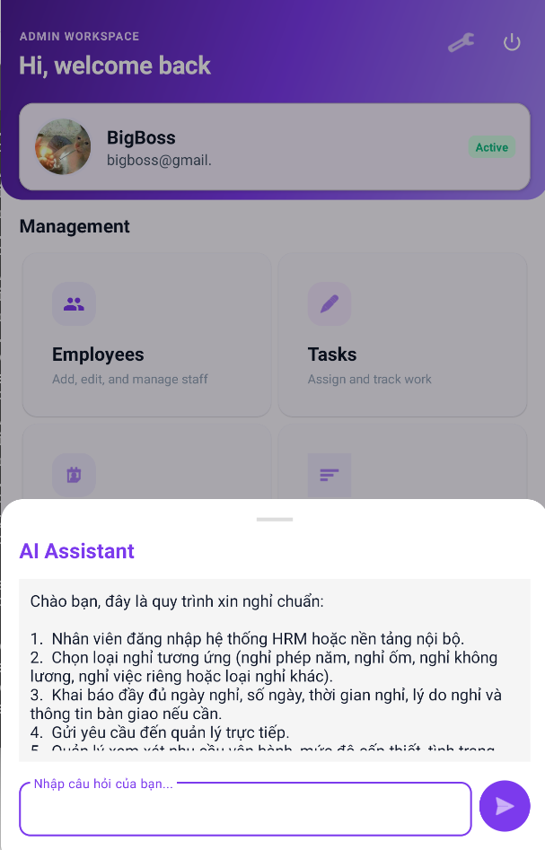

# HR RAG Chatbot

FastAPI backend for an HR assistant that answers two kinds of questions:

- Real-time employee status questions from HR data
- Internal policy and procedure questions from company documents using RAG

The system is designed for mobile or web clients that need a single chat endpoint, role-aware access control, source citations, and optional Firebase integration.


## Features

- Hybrid chat pipeline that routes between employee-data lookup and document RAG
- FastAPI REST API with Swagger docs
- Gemini-based intent classification, answer generation, and embeddings
- ChromaDB vector store for internal documents
- SQLite demo database for local development
- Firebase Auth and Firestore support for production-style integration
- Demo API keys for local testing without Firebase
- FCM notification endpoint for mobile push experiments

## Architecture

The request flow is:

1. Client calls `POST /api/chat`
2. `app.core.security` authenticates the caller with `X-API-Key` or Firebase Bearer token
3. `app.services.intent_service` classifies the question as:
   - `employee_status`
   - `document_qa`
   - `out_of_scope`
4. `app.services.rag_service` dispatches to:
   - Firestore or SQLite employee lookup for operational HR questions
   - Chroma retrieval for policy and handbook questions
5. `app.services.gemini_service` generates the final answer
6. API returns the answer, detected intent, and source metadata when documents were used

## Tech Stack

| Layer | Technology |
|---|---|
| API | FastAPI, Uvicorn |
| LLM | Google Gemini |
| Embeddings | Gemini Embeddings |
| RAG / Retrieval | LangChain, ChromaDB |
| Relational DB | SQLite, SQLAlchemy |
| Auth / Realtime HR data | Firebase Auth, Firestore |
| Notifications | Firebase Cloud Messaging |

## Project Structure

```text
app/
  api/          FastAPI route modules
  core/         Configuration and authentication
  db/           SQLAlchemy models, session, seed script
  prompts/      Prompt templates for routing and answer generation
  services/     Intent routing, RAG, embeddings, Gemini, Firestore access
  static/       Simple admin/demo UI
data/
  docs/         Source documents to ingest
  sqlite/       Local demo database
  chroma/       Vector store persistence
tests/          Test directory placeholder
```

## Requirements

- Python 3.11
- A Gemini API key for AI features
- Optional Firebase service account for Firebase Auth, Firestore, and FCM

## Quick Start

### 1. Clone and create a virtual environment

```bash
git clone <your-repo-url>
cd hr-rag-chatbot
python -m venv venv
```

Activate it:

```bash
# Windows
venv\Scripts\activate

# Linux / macOS
source venv/bin/activate
```

### 2. Install dependencies

```bash
pip install -r requirements.txt
pip install langchain-text-splitters
```

### 3. Configure environment variables

Create a local env file from the example:

```bash
copy .env.example .env
```

Then set at least:

```env
GOOGLE_API_KEY=your_gemini_api_key
APP_ENV=development
APP_DEBUG=true
```

If you want Firebase features, also configure:

```env
FIREBASE_PROJECT_ID=your-project-id
FIREBASE_CREDENTIALS_PATH=firebase-service-account.json
```

### 4. Seed demo data

```bash
python -m app.db.seed
```

This creates:

- Demo employee data in SQLite
- Attendance records
- Leave requests
- Required local data folders

### 5. Start the API

```bash
uvicorn app.main:app --reload --port 8000
```

Available URLs:

- API docs: `http://localhost:8000/docs`
- Admin UI: `http://localhost:8000/admin`
- Health check: `http://localhost:8000/health`

## Tutorial

### A. Test the server health

```bash
curl http://localhost:8000/health
```

Expected result:

- `gemini` is `configured` if the API key is set
- `chromadb` reports the current chunk count
- `sqlite` should be `ok`

### B. Chat with demo authentication

Use one of the built-in demo keys:

- `demo_employee_001`
- `demo_hr_001`
- `demo_manager_001`
- `demo_admin_001`

Example:

```bash
curl -X POST http://localhost:8000/api/chat ^
  -H "Content-Type: application/json" ^
  -H "X-API-Key: demo_hr_001" ^
  -d "{\"message\":\"Ai dang nghi phep hom nay?\",\"session_id\":\"demo-1\"}"
```

### C. Ingest documents into the vector store

Place files in `data/docs/` or upload through the API.

Supported formats:

- `.pdf`
- `.docx`
- `.txt`

Ingest all documents already present in `data/docs`:

```bash
curl -X POST http://localhost:8000/api/documents/ingest-all ^
  -H "X-API-Key: demo_hr_001"
```

Upload a single file:

```bash
curl -X POST http://localhost:8000/api/documents/ingest ^
  -H "X-API-Key: demo_admin_001" ^
  -F "file=@data/docs/Handbook.pdf" ^
  -F "title=Employee Handbook" ^
  -F "category=policy" ^
  -F "access_level=all" ^
  -F "department=general"
```

### D. Ask a document question

```bash
curl -X POST http://localhost:8000/api/chat ^
  -H "Content-Type: application/json" ^
  -H "X-API-Key: demo_employee_001" ^
  -d "{\"message\":\"Quy dinh nghi phep nam nhu the nao?\",\"session_id\":\"demo-2\"}"
```

If relevant chunks exist in ChromaDB, the response will include `sources`.

### E. Query direct employee endpoints

```bash
curl http://localhost:8000/api/employees/on-leave -H "X-API-Key: demo_hr_001"
curl http://localhost:8000/api/employees/stats -H "X-API-Key: demo_manager_001"
curl http://localhost:8000/api/employees/EMP001/status -H "X-API-Key: demo_employee_001"
```

## API Summary

| Method | Endpoint | Purpose |
|---|---|---|
| `GET` | `/` | Service index |
| `GET` | `/health` | Health and dependency status |
| `POST` | `/api/chat` | Main chatbot endpoint |
| `POST` | `/api/documents/ingest` | Upload and ingest one document |
| `POST` | `/api/documents/ingest-all` | Ingest all files in `data/docs` |
| `GET` | `/api/documents/stats` | Vector store statistics |
| `GET` | `/api/employees` | Filterable employee list |
| `GET` | `/api/employees/{employee_code}/status` | Employee detail by code |
| `GET` | `/api/employees/on-leave` | Employees currently on leave |
| `GET` | `/api/employees/expiring-contracts` | Contracts near expiration |
| `GET` | `/api/employees/stats` | Aggregate HR stats |
| `POST` | `/api/notify` | Send an FCM push notification |

## Authentication

### Demo mode

For local development, send:

```http
X-API-Key: demo_hr_001
```

### Firebase mode

For production-style authentication, send:

```http
Authorization: Bearer <firebase_id_token>
```

The backend verifies the token and then resolves the caller role from Firestore `Users`.

## Environment Variables

See `.env.example` for the full template.

Common variables:

| Variable | Purpose |
|---|---|
| `GOOGLE_API_KEY` | Gemini API key |
| `FIREBASE_PROJECT_ID` | Firebase project id |
| `FIREBASE_CREDENTIALS_PATH` | Local service account JSON path |
| `DATABASE_URL` | SQLAlchemy DB URL |
| `CHROMA_PERSIST_DIR` | Chroma persistence directory |
| `DOCS_DIR` | Document folder for ingestion |
| `APP_ENV` | Environment label |
| `APP_DEBUG` | Enables SQL echo and debug behavior |

## Notes for Public GitHub

- Do not commit real `.env` values
- Do not commit real Firebase service account files
- Do not commit sensitive internal HR documents into `data/docs`
- Demo data in SQLite is synthetic and should stay separate from production data

## Limitations

- Conversation memory is in-process only and resets on restart
- Response cache is in-memory only
- Intent classification is heuristic-first, then LLM fallback
- No automated test suite is currently wired into the repo

## Development Notes

- `app/services/rag_service.py` is the main orchestration layer
- `app/services/firestore_employee_service.py` is the production-style HR data adapter
- `app/services/employee_service.py` is the local SQLite fallback
- `app/services/ingest_service.py` handles chunking, embeddings, and Chroma writes

## License

Add your preferred license before publishing publicly.
