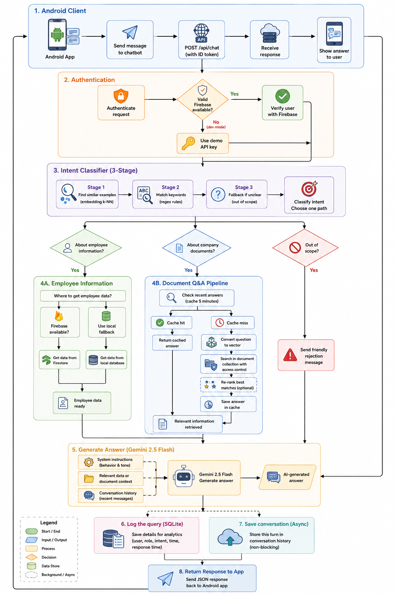

# Android HR Chatbot — RAG System

Backend server for an Android HR application. Handles employee status queries and internal policy questions using a hybrid RAG pipeline, serving JSON responses to the Android client via API.

## Overview

- Employee status questions are answered from live HR data.
- Policy and procedure questions are answered from ingested internal documents.
- Out-of-scope questions are politely declined.

The Android app authenticates users via Firebase Auth and sends requests to this server with a Bearer token. The server uses a three-stage intent classifier, vector retrieval, optional reranking, and Gemini-based answer generation.

## Architecture


*System Architecture Diagram — Android HR Chatbot RAG Pipeline*

## Tech Stack

| Layer | Technology |
|---|---|
| API | FastAPI, Uvicorn |
| LLM | Google Gemini 2.5 Flash |
| Embeddings | BAAI/bge-m3 |
| Reranker | BAAI/bge-reranker-v2-m3 |
| Vector store | ChromaDB |
| Database | SQLite, SQLAlchemy |
| Authentication | Firebase Auth, demo API key |
| Notifications | Firebase Cloud Messaging |

## Features

- Hybrid intent classification with embedding k-NN, regex, and LLM fallback
- Reranked RAG for policy questions
- Role-based document access filtering
- SQLite fallback for local development
- Conversation history persistence
- Request logging with latency tracking

## Requirements

- Python 3.11+
- Google Gemini API key
- Firebase service account, optional for production auth and Firestore

## Environment Variables

| Variable | Description | Default |
|---|---|---|
| `GOOGLE_API_KEY` | Gemini API key | required |
| `LOCAL_EMBEDDING_MODEL` | HuggingFace embedding model | `BAAI/bge-m3` |
| `RERANKER_MODEL` | Cross-encoder reranker model | `BAAI/bge-reranker-v2-m3` |
| `USE_RERANKER` | Enable reranking | `true` |
| `RERANKER_MIN_SCORE` | Minimum reranker score | `0.3` |
| `DATABASE_URL` | SQLite connection string | `sqlite:///data/sqlite/hr.db` |
| `CHROMA_PERSIST_DIR` | ChromaDB storage directory | `data/chroma` |
| `DOCS_DIR` | Source documents directory | `data/docs` |
| `FIREBASE_PROJECT_ID` | Firebase project ID | required for production |
| `FIREBASE_CREDENTIALS_PATH` | Path to service account JSON | `firebase-service-account.json` |

## Authentication

### Demo mode

Pass one of the demo keys in the `X-API-Key` header.

| Key | Role |
|---|---|
| `demo_employee_001` | employee |
| `demo_hr_001` | hr |
| `demo_manager_001` | manager |
| `demo_admin_001` | admin |

### Production mode

The Android app obtains a Firebase ID token after login and attaches it to every request:

```http
Authorization: Bearer <firebase_id_token>
```

## API Reference

### Chat

```http
POST /api/chat
X-API-Key: demo_employee_001
Content-Type: application/json

{
  "message": "What is the annual leave policy?",
  "session_id": "sess_001"
}
```

### Other endpoints

| Method | Endpoint | Auth | Description |
|---|---|---|---|
| `GET` | `/health` | No | Service health check |
| `POST` | `/api/chat` | Yes | Main chat endpoint |
| `POST` | `/api/docs/ingest` | admin | Upload and index a document |
| `GET` | `/api/docs/stats` | Yes | Vector store statistics |
| `GET` | `/api/employees` | hr / manager / admin | List employees |
| `GET` | `/api/employees/on-leave` | hr / manager / admin | Employees currently on leave |
| `GET` | `/api/logs` | admin | Query history and latency log |
| `POST` | `/api/notify` | hr / admin | Send push notification via FCM |

## Extending Intent Classification

Edit `app/data/intent_examples.json` and restart the server to add new phrasings or new intent groups.

Benchmark Results

Run date: 2026-05-01 | 38 questions | 0 request errors

Metric	Value
Overall accuracy	94.7% (36 / 38)
document_qa	93.3% (28 / 30)
employee_status	100% (3 / 3)
out_of_scope	100% (5 / 5)

Full report: docs/ground_truth_test_report_2026-05-13.md

## Project Structure

```text
hr-rag-chatbot/
├── app/
│   ├── api/
│   ├── core/
│   ├── data/
│   ├── db/
│   ├── prompts/
│   ├── services/
│   └── main.py
├── data/
│   ├── docs/
│   ├── chroma/
│   └── sqlite/
├── docs/
├── tests/
├── .env.example
├── README.md
└── requirements.txt
```

## Known Limitations

- In-process cache is not shared across multiple workers
- No request throttling on the chat endpoint
- CORS currently allows all origins
- Gemini latency varies with upstream load
- Legacy `.doc` files still require Windows COM automation
